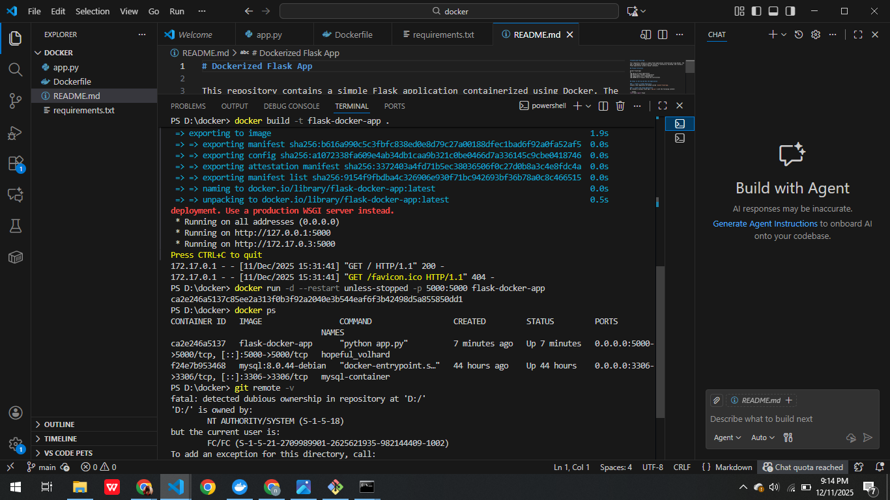

# Dockerized Flask App

This repository contains a simple Flask application containerized using Docker. The app is designed to demonstrate the process of setting up, building, and running a Flask application inside a Docker container.


## Screenshots

### Docker Build Process


### Application Running in Docker


## Project Structure

docker-flask-app/
│
├── app.py # Flask application
├── Dockerfile # Docker configuration
├── requirements.txt # Dependencies
├── README.md # Project setup and instructions


## Steps to Set Up and Run the Application

### 1. Create a GitHub Repository
Create a new repository on GitHub called `docker-flask-app`.

### 2. Create the Flask Application
We created a minimal Flask app (`app.py`) with the following content:

```python
from flask import Flask

app = Flask(__name__)

@app.route('/')
def hello_world():
    return 'Hello, Docker World!'

if __name__ == "__main__":
    app.run(host='0.0.0.0', port=5000)
```

### 3. Create the Dockerfile

The Dockerfile was created to define the steps for containerizing the application:

```

# Use the official Python base image
FROM python:3.9-slim

# Set the working directory inside the container
WORKDIR /app

# Copy the application files into the container
COPY . /app

# Install the dependencies (in this case Flask)
RUN pip install --no-cache-dir -r requirements.txt

# Expose the port the app will run on
EXPOSE 5000

# Command to run the application
CMD ["python", "app.py"]

```

### 4. Create the requirements.txt File

We created a requirements.txt file to list the necessary dependencies:

```
flask
```
### 5. Build and Run the Docker Image

To build and run the Docker image, we followed these steps:

## 5.1 Build the Docker Image:

```
docker build -t flask-docker-app .
```
## 5.2 Run the Docker Container:
```
docker run -p 5000:5000 flask-docker-app

```
We verified the application by visiting http://localhost:5000 or using the following curl command:
```
curl http://localhost:5000
```

### 6. Configure Container Restart Policy

To ensure the container restarts after a reboot, we ran the following command:
```
docker run -d --restart unless-stopped -p 5000:5000 flask-docker-app
```
### 7. Optional: Create Systemd Service (for Production Servers)

To run the container as a systemd service on a Linux server:

1-We created the service file /etc/systemd/system/flask-docker-app.service:

```
[Unit]
Description=Flask Docker App
After=docker.service
Requires=docker.service

[Service]
Restart=always
ExecStart=/usr/bin/docker run --rm -p 5000:5000 flask-docker-app

[Install]
WantedBy=multi-user.target
```

### 8. Push the Docker Image to Docker Hub (Optional)

If you want to share your Docker image, you can push it to Docker Hub:

8.1 Log into Docker Hub:
```
docker login
```
8.2 Tag the Image:
```
docker tag flask-docker-app yourusername/flask-docker-app:latest
```
8.3 Push the Image:
```
docker push yourusername/flask-docker-app:latest
```
